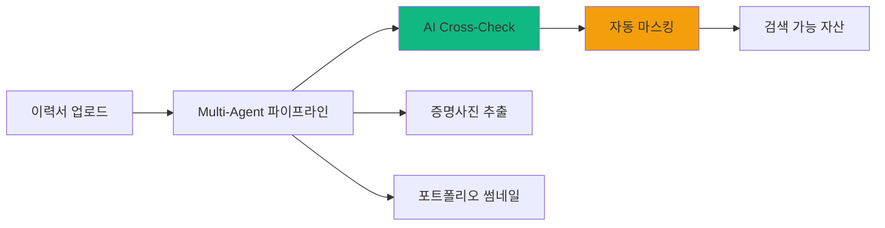
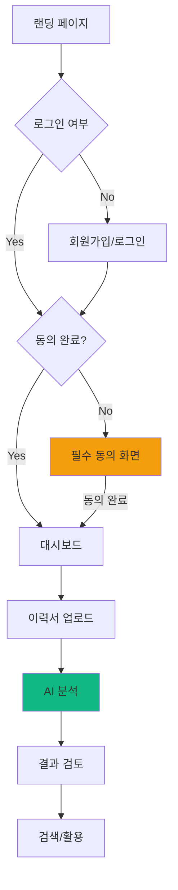
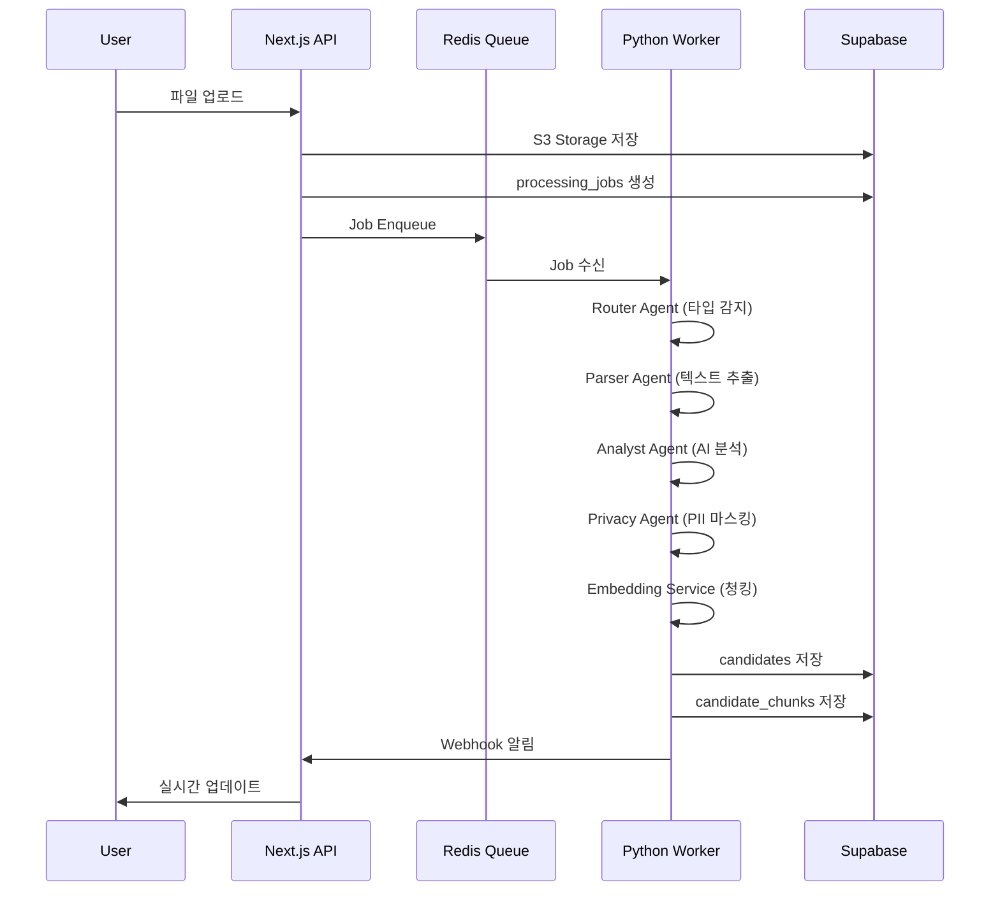

# RAI PRD v0.2 - Product Requirements Document

## HR Screener: Recruitment Asset Intelligence (RAI)

| 항목 | 내용 |
|------|------|
| Document Ver | **V0.2 (Code-Synchronized)** |
| Status | **Development In Progress** |
| Product Name | HR Screener |
| Target | High-End Freelance Headhunters |
| Core Philosophy | **"Zero Tolerance for Error"** (타협 없는 정확도) |
| Phase | Phase 1 (Core MVP) Development |
| Last Updated | 2026-01-13 |

---

## 📋 Document Purpose

이 문서는 RAI 서비스의 **공식 요구사항 명세서**입니다.

- **기획 담당자**: 서비스 기능 범위 및 우선순위 확인
- **개발 담당자**: 구현해야 할 기능과 기술 스펙 참조
- **QA 담당자**: 테스트 케이스 작성 기준
- **신규 팀원**: 프로젝트 온보딩 문서

> [!IMPORTANT]
> 이 문서는 현재 개발된 코드베이스를 기준으로 작성되었습니다. 
> PRD v6.0과 실제 구현 간의 차이점을 명확히 표시합니다.

---

## 1. Executive Summary

### 1.1. The Pain (문제 정의)

| 문제 | 상세 설명 | 심각도 |
|------|----------|--------|
| **Dead Assets** | 헤드헌터 PC에 수천 개 이력서가 검색 불가 상태로 방치 | 🔴 Critical |
| **Risk & Admin** | 블라인드 처리 실수로 직거래 위험, 단순 행정에 40% 시간 낭비 | 🟠 High |
| **Legal Risk** | 후보자 개인정보 처리에 대한 법적 책임 불명확 | 🔴 Critical |

### 1.2. The Solution (해결책)



| 솔루션 영역 | 기능 | 현재 상태 |
|------------|------|----------|
| **Ingestion** | HWP/PDF/DOCX 멀티포맷 파싱 | ✅ 구현 완료 |
| **AI Analysis** | 2-Way Cross-Check (GPT + Gemini) | ✅ 구현 완료 |
| **Privacy** | AES-256-GCM 암호화, PII 마스킹 | ✅ 구현 완료 |
| **Compliance** | 제3자 정보 보증 동의 | ✅ 구현 완료 |
| **Search** | 하이브리드 검색 (RDB + Vector) | ✅ 구현 완료 |
| **Visual** | 증명사진/포트폴리오 추출 | ✅ 구현 완료 |
| **Review UI** | AI 결과 검토/수정 UI | 🟡 부분 구현 |

---

## 2. Implementation Status

### 2.1. 구현 완료 기능 (Implemented)

#### 2.1.1. Multi-Agent Pipeline

```
apps/worker/
├── agents/
│   ├── router_agent.py      ✅ 파일 타입 감지, DRM 체크, 페이지 제한
│   ├── analyst_agent.py     ✅ 2-Way Cross-Check (GPT + Gemini)
│   ├── privacy_agent.py     ✅ AES-256-GCM 암호화, PII 마스킹
│   ├── visual_agent.py      ✅ OpenCV 얼굴 감지, Playwright 스크린샷
│   ├── identity_checker.py  ✅ 다중 인물 감지
│   └── validation_agent.py  ✅ 유효성 검증
├── services/
│   ├── embedding_service.py ✅ 청킹 + text-embedding-3-small
│   ├── database_service.py  ✅ Supabase 저장
│   ├── llm_manager.py       ✅ OpenAI/Gemini 통합
│   └── queue_service.py     ✅ Redis Queue 관리
└── utils/
    ├── hwp_parser.py        ✅ HWP 파싱 (olefile)
    ├── pdf_parser.py        ✅ PDF 파싱 (pdfplumber)
    └── docx_parser.py       ✅ DOCX 파싱 (python-docx)
```

#### 2.1.2. Frontend (Next.js 14)

```
app/
├── (auth)/
│   ├── login/               ✅ 소셜 로그인 (Google)
│   ├── signup/              ✅ 이메일 회원가입
│   └── consent/             ✅ 필수 동의 화면 (PRD 요구사항 충족)
├── (dashboard)/
│   ├── candidates/          ✅ 후보자 목록
│   ├── upload/              ✅ 파일 업로드 UI
│   ├── analytics/           ✅ 분석 대시보드
│   ├── positions/           ✅ 포지션 관리
│   ├── settings/            ✅ 설정 페이지
│   └── risk/                ✅ 리스크 관리
└── api/
    ├── search/              ✅ 하이브리드 검색 API
    ├── candidates/          ✅ 후보자 CRUD
    ├── upload/              ✅ 업로드 처리
    └── webhooks/            ✅ Worker 콜백
```

#### 2.1.3. Database Schema (Supabase)

| 테이블 | 용도 | 상태 |
|--------|------|------|
| `users` | 사용자 정보, 플랜, 크레딧 | ✅ |
| `user_consents` | 약관 동의 기록 | ✅ |
| `candidates` | 후보자 정형 데이터 | ✅ |
| `candidate_chunks` | Vector 검색용 청크 (pgvector) | ✅ |
| `processing_jobs` | 처리 작업 추적 | ✅ |
| `search_feedback` | 검색 피드백 | ✅ |
| `credit_transactions` | 크레딧 거래 이력 | ✅ |
| `skill_synonyms` | 기술 동의어 매핑 | ✅ |
| `positions` | 채용 포지션 관리 | ✅ |
| `saved_searches` | 저장된 검색 조건 | ✅ |

### 2.2. 미구현/부분 구현 기능 (Gaps)

> [!WARNING]
> 아래 기능들은 PRD v6.0에 명시되었으나 현재 구현되지 않았거나 부분 구현 상태입니다.

#### 2.2.1. HWP 3단계 Fallback

| Fallback 단계 | PRD 요구사항 | 현재 상태 |
|--------------|-------------|----------|
| 1차: olefile | 직접 파싱 | ✅ 구현됨 |
| 2차: LibreOffice | HWP→PDF 변환 | ⚠️ 코드 존재, 미검증 |
| 3차: 한컴 API | 유료 백업 | ❌ 미구현 |

**권장 조치**: LibreOffice Fallback 테스트 케이스 추가, 한컴 API 연동 검토

#### 2.2.2. Payment Integration

| 기능 | PRD 요구사항 | 현재 상태 |
|------|-------------|----------|
| Stripe 연동 | 결제 처리 | ❌ 미구현 |
| Paddle 연동 | 구독 관리 | 🟡 스키마만 존재 |
| Auto-Reload | 자동 충전 | ❌ 미구현 |
| Overage Billing | 초과 과금 | ❌ 미구현 |

**권장 조치**: Phase 2에서 Paddle 먼저 연동 (한국 시장 호환성)

#### 2.2.3. 3-Way Cross-Check (Phase 2)

| 기능 | PRD 요구사항 | 현재 상태 |
|------|-------------|----------|
| Claude 3.5 연동 | Enterprise 전용 | ❌ 미구현 |
| 3-Way 비교 로직 | 다수결 채택 | ❌ 미구현 |

**권장 조치**: Enterprise 플랜 출시 시점에 구현

#### 2.2.4. Blind Export

| 기능 | PRD 요구사항 | 현재 상태 |
|------|-------------|----------|
| 블라인드 이력서 생성 | 개인정보 마스킹 버전 | 🟡 DB 스키마만 존재 |
| PDF 내보내기 | 마스킹된 PDF 생성 | ❌ 미구현 |
| 월간 제한 | Starter 30회, Pro 무제한 | ❌ 미구현 |

**권장 조치**: `@react-pdf/renderer` 활용해 구현

#### 2.2.5. AI 검토 UI 고도화

| 기능 | PRD 요구사항 | 현재 상태 |
|------|-------------|----------|
| 필드별 수정 UI | EditableField 컴포넌트 | 🟡 기본 구현 |
| 모델 간 불일치 표시 | 툴팁으로 상세 표시 | ❌ 미구현 |
| 신뢰도 레벨 표시 | HIGH/MED/LOW 배지 | ✅ 구현됨 |

#### 2.2.6. Sales Radar (Phase 2)

| 기능 | PRD 요구사항 | 현재 상태 |
|------|-------------|----------|
| 채용공고 크롤링 | 자동 수집 | ❌ 미구현 |
| 공고-후보자 매칭 | 자동 추천 | ❌ 미구현 |

**권장 조치**: Phase 2 로드맵에 포함

---

## 3. Functional Specifications

### 3.1. User Flow



### 3.2. Consent Flow (PRD 완전 구현)

**현재 구현 위치**: `app/(auth)/consent/page.tsx`

| 동의 항목 | 필수 여부 | 저장 필드 |
|----------|----------|----------|
| 서비스 이용약관 | ✅ 필수 | `terms_of_service` |
| 개인정보 처리방침 | ✅ 필수 | `privacy_policy` |
| 제3자 정보 보증 | ✅ 필수 | `third_party_data_guarantee` |
| 마케팅 정보 수신 | ⬜ 선택 | `marketing_consent` |

**Middleware 체크** (`middleware.ts`):
- 보호된 경로 접근 시 `users.consents_completed` 확인
- 제3자 정보 보증 동의 여부 이중 확인
- 미완료 시 `/consent` 페이지로 리다이렉트

### 3.3. Upload Pipeline



### 3.4. Hybrid Search

**현재 구현 위치**: `app/api/search/route.ts`

| 검색 모드 | 조건 | 사용 기술 |
|----------|------|----------|
| **Keyword Search** | 쿼리 10자 이하 | RDB (PostgreSQL) |
| **Semantic Search** | 쿼리 10자 초과 | Vector (pgvector) |

**검색 최적화 기능**:
- ✅ 스킬 동의어 확장 (DB 기반)
- ✅ 병렬 쿼리 (스킬 2개 이상)
- ✅ 캐싱 (Redis)
- ✅ Facet 계산

---

## 4. Technical Architecture

### 4.1. Tech Stack (Implemented)

| 레이어 | 기술 | 상태 |
|--------|------|------|
| **Frontend** | Next.js 14 (App Router) | ✅ |
| **UI** | Shadcn UI + TailwindCSS | ✅ |
| **Backend (BFF)** | Next.js API Routes | ✅ |
| **Worker** | Python FastAPI | ✅ |
| **Database** | Supabase (PostgreSQL) | ✅ |
| **Vector DB** | pgvector | ✅ |
| **Encryption** | AES-256-GCM (cryptography) | ✅ |
| **Queue** | Redis (RQ) | ✅ |
| **File Storage** | Supabase Storage | ✅ |
| **AI - 분석** | OpenAI GPT-4o + Google Gemini | ✅ |
| **AI - 임베딩** | text-embedding-3-small | ✅ |
| **이미지 처리** | OpenCV | ✅ |
| **스크린샷** | Playwright | ✅ |
| **Hosting - Web** | Vercel | ✅ |
| **Hosting - Worker** | Railway | ✅ |
| **Monitoring** | Sentry | ✅ |

### 4.2. System Architecture

```
┌─────────────────────────────────────────────────────────────────────────┐
│                         USER LAYER                                       │
│  Browser → Next.js 14 (Vercel)                                          │
├─────────────────────────────────────────────────────────────────────────┤
│                         API LAYER                                        │
│  /api/upload    /api/search    /api/candidates    /api/webhooks         │
├─────────────────────────────────────────────────────────────────────────┤
│                         DATA LAYER                                       │
│  ┌──────────────────┐      ┌──────────────────┐                         │
│  │    SUPABASE      │      │  PYTHON WORKER   │                         │
│  │  PostgreSQL      │◄────►│  FastAPI (Railway)│                        │
│  │  + pgvector      │      │                   │                        │
│  │  + pgcrypto      │      │  Multi-Agent:     │                        │
│  │                  │      │  - Router         │                        │
│  │  Storage (S3)    │      │  - Analyst        │                        │
│  │  Auth            │      │  - Privacy        │                        │
│  └──────────────────┘      │  - Embedding      │                        │
│           ▲                └──────────────────┘                         │
│           │                         ▲                                   │
│           └─────────────────────────┘                                   │
│                      Redis Queue                                        │
└─────────────────────────────────────────────────────────────────────────┘
```

---

## 5. Data Schema (Current Implementation)

### 5.1. candidates 테이블

```sql
CREATE TABLE candidates (
    id UUID PRIMARY KEY,
    user_id UUID NOT NULL REFERENCES users(id),
    
    -- 기본 정보
    name TEXT NOT NULL,
    birth_year INTEGER,
    gender TEXT,
    
    -- 암호화 필드 (AES-256-GCM)
    phone_encrypted TEXT,
    email_encrypted TEXT,
    address_encrypted TEXT,
    
    -- 검색용 해시 (SHA-256)
    phone_hash TEXT,
    email_hash TEXT,
    
    -- 필터링용 정형 필드
    skills TEXT[],
    exp_years INTEGER,
    last_company TEXT,
    last_position TEXT,
    education_level TEXT,
    location_city TEXT,
    
    -- AI 생성 필드
    summary TEXT,
    strengths TEXT[],
    careers JSONB,
    projects JSONB,
    
    -- 시각 자산
    photo_url TEXT,
    portfolio_thumbnail_url TEXT,
    
    -- 버전 관리
    version INTEGER DEFAULT 1,
    parent_id UUID,
    is_latest BOOLEAN DEFAULT true,
    
    -- AI 분석 메타
    confidence_score FLOAT,
    analysis_mode TEXT,
    requires_review BOOLEAN,
    risk_level TEXT,
    
    -- 상태
    status TEXT DEFAULT 'processing',
    
    created_at TIMESTAMPTZ DEFAULT NOW(),
    updated_at TIMESTAMPTZ DEFAULT NOW()
);
```

### 5.2. candidate_chunks 테이블 (Vector)

```sql
CREATE TABLE candidate_chunks (
    id UUID PRIMARY KEY,
    candidate_id UUID NOT NULL REFERENCES candidates(id),
    chunk_type TEXT NOT NULL,  -- summary, career, project, skill, education
    content TEXT NOT NULL,
    embedding vector(1536),     -- text-embedding-3-small
    metadata JSONB
);

-- IVFFlat 인덱스
CREATE INDEX idx_candidate_chunks_embedding 
ON candidate_chunks USING ivfflat (embedding vector_cosine_ops);
```

---

## 6. Pricing & Credit System

### 6.1. 요금제 (PRD 기준)

| Plan | 가격 | 크레딧 | Cross-Check |
|------|------|--------|-------------|
| **Starter** | ₩79,000/월 | 50 | 2-Way (GPT+Gemini) |
| **Pro** | ₩149,000/월 | 150 | 2-Way (GPT+Gemini) |
| **Enterprise** | ₩199,000/월 | 300+ | 3-Way (+Claude) |

### 6.2. 크레딧 정책 (구현됨)

| 정책 | 내용 | 상태 |
|------|------|------|
| 1 File = 1 Credit | 페이지 수 무관 | ✅ |
| 50페이지 초과 | 업로드 거절 | ✅ |
| Multi-Identity | 2명 이상 감지 시 거절 | ✅ |
| DRM/암호화 | 즉시 반려 | ✅ |

### 6.3. 구현 필요 항목

| 기능 | 우선순위 |
|------|----------|
| Paddle 구독 연동 | 🔴 High |
| 자동 충전 (Auto-Reload) | 🟠 Medium |
| 초과 과금 | 🟠 Medium |
| 무료 체험 크레딧 | 🟡 Low |

---

## 7. Security & Compliance

### 7.1. 5대 리스크 방어 (구현 현황)

| 리스크 | 대응 | 구현 위치 | 상태 |
|--------|------|----------|------|
| **직거래 (Skipping)** | PII 자동 마스킹 | `privacy_agent.py` | ✅ |
| **개인정보 유출** | AES-256-GCM 암호화 | `privacy_agent.py` | ✅ |
| **악성 파일/DRM** | Header Sniffing | `router_agent.py` | ✅ |
| **프롬프트 주입** | System Hardening | `llm_manager.py` | ✅ |
| **개인정보보호법** | 제3자 동의 필수 | `consent/page.tsx` | ✅ |

### 7.2. 암호화 키 관리

```python
# privacy_agent.py - Key Rotation 지원
ENCRYPTION_KEY          # 현재 활성 키
ENCRYPTION_KEY_V1       # 이전 버전 (복호화 전용)
ENCRYPTION_KEY_VERSION  # 현재 버전 번호
```

### 7.3. CSRF 보호

**구현 위치**: `middleware.ts`, `lib/csrf.ts`

- API 경로 POST/PUT/DELETE/PATCH 요청 시 CSRF 토큰 검증
- Origin/Referer 헤더 검증

---

## 8. Phase Roadmap

### 8.1. Phase 1: Core MVP (현재)

| 영역 | 기능 | 상태 |
|------|------|------|
| Ingestion | Multi-format 파싱 | ✅ |
| AI | 2-Way Cross-Check | ✅ |
| Privacy | 암호화/마스킹 | ✅ |
| Search | 하이브리드 검색 | ✅ |
| Compliance | 동의 플로우 | ✅ |
| **Payment** | **결제 연동** | ❌ 필요 |
| **Blind Export** | **블라인드 이력서** | ❌ 필요 |

### 8.2. Phase 2: Premium (향후)

| 기능 | 설명 | 우선순위 |
|------|------|----------|
| 3-Way Cross-Check | + Claude (Enterprise) | 🟠 |
| Sales Radar | 채용공고 크롤링 + 매칭 | 🟡 |
| Team CRM | 다중 사용자, 권한 관리 | 🟠 |
| 고급 분석 | 채용 성공률 예측 | 🟡 |

---

## 9. Success Metrics (KPI)

| 지표 | 목표 (Phase 1) | 측정 방법 |
|------|----------------|-----------| 
| **파싱 성공률** | 95%+ | 처리 완료 / 전체 업로드 |
| **AI 정확도** | 96%+ | 사용자 수정률 역산 |
| **검색 만족도** | 80%+ | 피드백 'relevant' 비율 |
| **HWP 실패율** | 5% 미만 | Fallback 후 실패 건수 |

---

## 10. Appendix

### 10.1. 요금제 상수 (구현용)

```typescript
// lib/config/plans.ts
export const PLANS = {
  starter: {
    name: "Starter (실속형)",
    price: 79000,
    baseCredits: 50,
    overageCost: 1500,
    blindExportLimit: 30,
    crossCheckMode: "phase_1",
  },
  pro: {
    name: "Pro (비즈니스형)",
    price: 149000,
    baseCredits: 150,
    overageCost: 1000,
    blindExportLimit: Infinity,
    crossCheckMode: "phase_1",
  },
  enterprise: {
    name: "Enterprise (확장형)",
    price: 199000,
    baseCredits: 300,
    overageCost: null,
    blindExportLimit: Infinity,
    crossCheckMode: "phase_2",
  },
};
```

### 10.2. 신뢰도 레벨

```typescript
// types/index.ts
export const CONFIDENCE_LEVELS = {
  HIGH: { threshold: 95, color: "green", badge: "완료" },
  MEDIUM: { threshold: 80, color: "yellow", badge: "검토 권장" },
  LOW: { threshold: 0, color: "red", badge: "검토 필요" },
};
```

### 10.3. 청크 타입별 가중치

```typescript
export const CHUNK_WEIGHTS = {
  summary: 1.0,
  career: 0.9,
  skill: 0.85,
  project: 0.8,
  education: 0.5,
};
```

---

## Document History

| 버전 | 날짜 | 변경 내용 | 작성자 |
|------|------|-----------|--------|
| V6.0 | 2025.01 | 초기 PRD | - |
| V0.2 | 2026.01.13 | 코드베이스 동기화, Gap 분석 | Senior PM |

---

## Gap Summary (PRD v6.0 vs 현재 구현)

### ✅ 구현 완료 (15개)
1. Multi-Agent Pipeline (Router, Analyst, Privacy, Visual, Embedding)
2. 2-Way Cross-Check (GPT + Gemini)
3. AES-256-GCM 암호화 + 키 로테이션
4. PII 마스킹 (전화번호, 이메일, 주민번호)
5. 동의 플로우 (제3자 정보 보증 포함)
6. 하이브리드 검색 (RDB + Vector)
7. 스킬 동의어 확장 (DB 기반)
8. 검색 피드백 수집
9. 병렬 쿼리 최적화
10. 청킹 전략 (summary/career/project/skill/education)
11. HWP/PDF/DOCX 파싱
12. 증명사진 추출 (OpenCV)
13. 포트폴리오 썸네일 (Playwright)
14. CSRF 보호
15. Rate Limiting

### ⚠️ 부분 구현 (3개)
1. HWP 3단계 Fallback (2단계까지)
2. AI 검토 UI (기본 수정만)
3. Paddle 스키마 (연동 미완)

### ❌ 미구현 (7개)
1. 3-Way Cross-Check (Claude 연동)
2. Stripe/Paddle 결제 연동
3. 블라인드 이력서 내보내기
4. 자동 충전 (Auto-Reload)
5. 초과 과금
6. Sales Radar
7. 팀 협업 (CRM)

---

*이 문서는 RAI 서비스의 공식 요구사항 명세서입니다.*
*개발 상세 사항은 해당 코드베이스를 참조하세요.*
