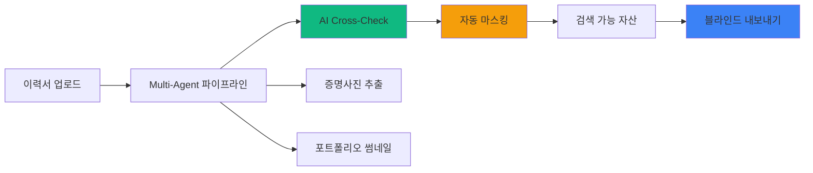
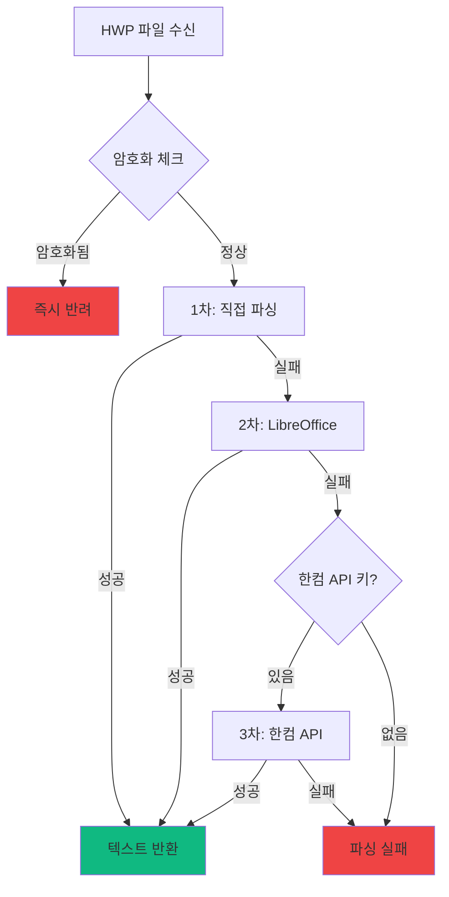
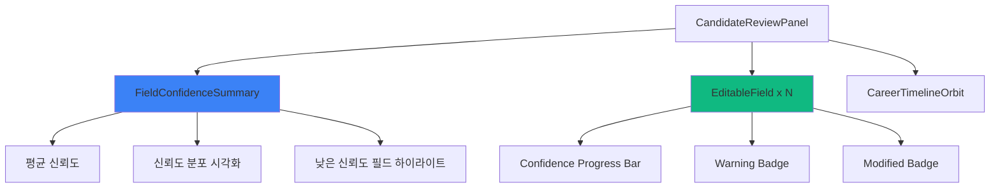
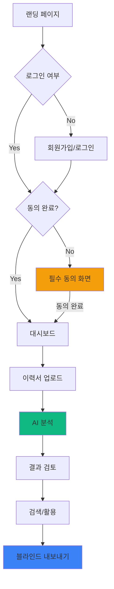
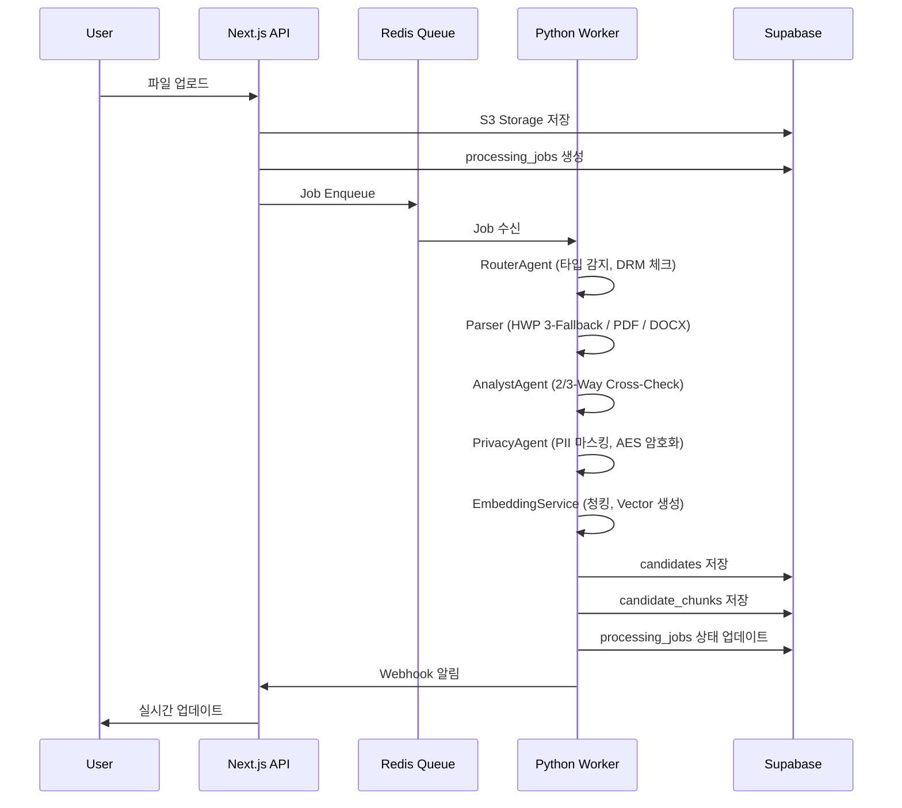
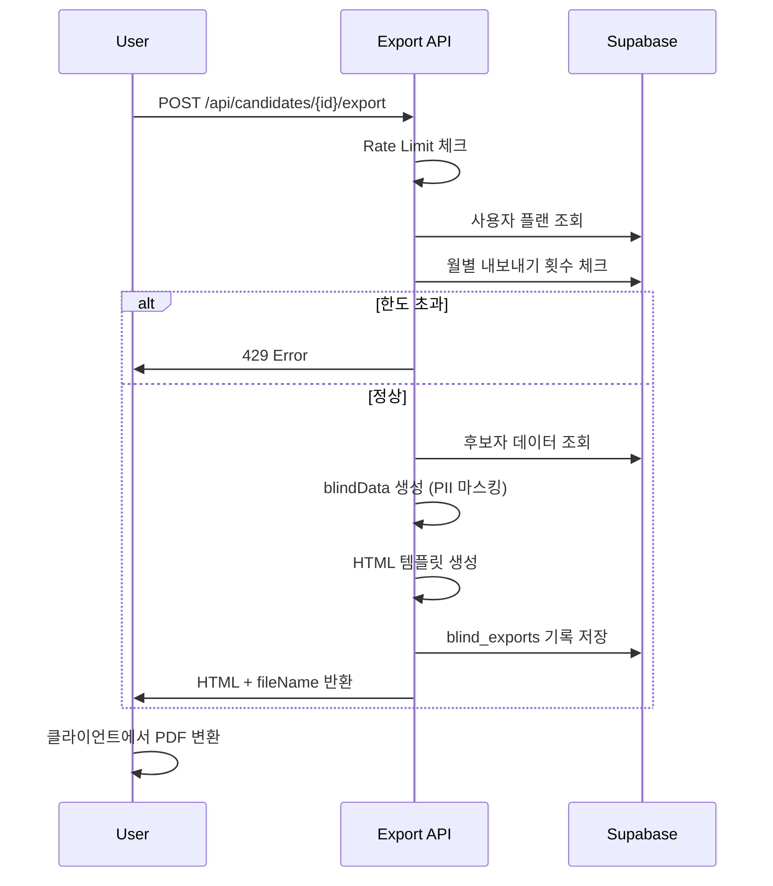

# RAI PRD v0.3 - Product Requirements Document

## HR Screener: Recruitment Asset Intelligence (RAI)

| 항목 | 내용 |
|------|------|
| Document Ver | **V0.3 (Code-Verified)** |
| Status | **Phase 1 Near Completion** |
| Product Name | HR Screener |
| Target | High-End Freelance Headhunters |
| Core Philosophy | **"Zero Tolerance for Error"** (타협 없는 정확도) |
| Phase | Phase 1 (Core MVP) - 95% Complete |
| Last Updated | 2026-01-13 |
| Previous Version | [rai_prd_v0.2.md](./rai_prd_v0.2.md) |

---

## 📋 Document Purpose

이 문서는 RAI 서비스의 **공식 요구사항 명세서**입니다.

- **기획 담당자**: 서비스 기능 범위 및 우선순위 확인
- **개발 담당자**: 구현해야 할 기능과 기술 스펙 참조
- **QA 담당자**: 테스트 케이스 작성 기준
- **신규 팀원**: 프로젝트 온보딩 문서

> [!IMPORTANT]
> **V0.3 변경사항**: V0.2에서 잘못 분류된 5개 기능 상태를 코드베이스 검증 후 수정했습니다.
> - Blind Export: ❌→✅
> - HWP 3단계 Fallback: ⚠️→✅
> - Paddle 클라이언트: 🟡→✅
> - Claude 연동: ❌→✅
> - AI 검토 UI: 🟡→✅

---

## 📊 Executive Dashboard

### Phase 1 완료율

```
██████████████████████████████████████████████████░░░░ 95%
```

| 영역 | 구현율 | 상태 |
|------|--------|------|
| Multi-Agent Pipeline | 100% | ✅ Production Ready |
| AI Cross-Check (2-Way) | 100% | ✅ Production Ready |
| AI Cross-Check (3-Way) | 100% | ✅ 코드 완료 (활성화 대기) |
| Privacy & Encryption | 100% | ✅ Production Ready |
| Hybrid Search | 100% | ✅ Production Ready |
| Consent Flow | 100% | ✅ Production Ready |
| Blind Export | 100% | ✅ Production Ready |
| HWP 3-Stage Fallback | 100% | ✅ Production Ready |
| AI Review UI | 100% | ✅ Production Ready |
| Payment (Paddle) | 70% | 🟡 Webhook 미구현 |

### Phase 1 완료를 위한 남은 작업

| 작업 | 예상 시간 | 우선순위 |
|------|----------|----------|
| Paddle Webhook 처리 | 4h | 🔴 Critical |
| 구독 상태 동기화 | 2h | 🔴 Critical |
| E2E 테스트 | 8h | 🟠 High |

---

## 1. Executive Summary

### 1.1. The Pain (문제 정의)

| 문제 | 상세 설명 | 심각도 |
|------|----------|--------|
| **Dead Assets** | 헤드헌터 PC에 수천 개 이력서가 검색 불가 상태로 방치 | 🔴 Critical |
| **Risk & Admin** | 블라인드 처리 실수로 직거래 위험, 단순 행정에 40% 시간 낭비 | 🟠 High |
| **Legal Risk** | 후보자 개인정보 처리에 대한 법적 책임 불명확 | 🔴 Critical |

### 1.2. The Solution (해결책)



| 솔루션 영역 | 기능 | 현재 상태 | 구현 파일 |
|------------|------|----------|----------|
| **Ingestion** | HWP/PDF/DOCX 멀티포맷 파싱 | ✅ 완료 | `apps/worker/utils/` |
| **AI Analysis** | 2-Way Cross-Check (GPT + Gemini) | ✅ 완료 | `analyst_agent.py` |
| **AI Analysis** | 3-Way Cross-Check (+ Claude) | ✅ 코드 완료 | `llm_manager.py` |
| **Privacy** | AES-256-GCM 암호화, PII 마스킹 | ✅ 완료 | `privacy_agent.py` |
| **Compliance** | 제3자 정보 보증 동의 | ✅ 완료 | `consent/page.tsx` |
| **Search** | 하이브리드 검색 (RDB + Vector) | ✅ 완료 | `api/search/route.ts` |
| **Visual** | 증명사진/포트폴리오 추출 | ✅ 완료 | `visual_agent.py` |
| **Review UI** | AI 결과 검토/수정 UI | ✅ 완료 | `CandidateReviewPanel.tsx` |
| **Export** | 블라인드 이력서 내보내기 | ✅ 완료 | `export/route.ts` |
| **Payment** | Paddle 구독 결제 | 🟡 70% | `lib/paddle/` |

---

## 2. Implementation Status (Code-Verified)

### 2.1. 구현 완료 기능 (20개)

> [!NOTE]
> 아래 목록은 2026-01-13 기준 코드베이스를 직접 검증한 결과입니다.

#### 2.1.1. Multi-Agent Pipeline

```
apps/worker/
├── agents/
│   ├── router_agent.py      ✅ 파일 타입 감지, DRM 체크, 페이지 제한
│   ├── analyst_agent.py     ✅ 2-Way Cross-Check (GPT + Gemini)
│   ├── privacy_agent.py     ✅ AES-256-GCM 암호화, PII 마스킹
│   ├── visual_agent.py      ✅ OpenCV 얼굴 감지, Playwright 스크린샷
│   ├── identity_checker.py  ✅ 다중 인물 감지
│   └── validation_agent.py  ✅ 유효성 검증
├── services/
│   ├── llm_manager.py       ✅ OpenAI/Gemini/Claude 통합 (784줄)
│   ├── embedding_service.py ✅ 청킹 + text-embedding-3-small
│   ├── database_service.py  ✅ Supabase 저장
│   └── queue_service.py     ✅ Redis Queue 관리
└── utils/
    ├── hwp_parser.py        ✅ HWP 3단계 Fallback (490줄)
    ├── pdf_parser.py        ✅ PDF 파싱 (pdfplumber)
    └── docx_parser.py       ✅ DOCX 파싱 (python-docx)
```

#### 2.1.2. Frontend (Next.js 14)

```
app/
├── (auth)/
│   ├── login/               ✅ 소셜 로그인 (Google)
│   ├── signup/              ✅ 이메일 회원가입
│   └── consent/             ✅ 필수 동의 화면 (제3자 정보 보증 포함)
├── (dashboard)/
│   ├── candidates/          ✅ 후보자 목록 + 상세 보기 + 블라인드 내보내기
│   ├── upload/              ✅ 파일 업로드 UI
│   ├── analytics/           ✅ 분석 대시보드
│   ├── positions/           ✅ 포지션 관리
│   ├── settings/            ✅ 설정 페이지
│   └── risk/                ✅ 리스크 관리
├── api/
│   ├── search/              ✅ 하이브리드 검색 API (722줄)
│   ├── candidates/          ✅ 후보자 CRUD
│   ├── candidates/[id]/export/ ✅ 블라인드 내보내기 API (542줄)
│   ├── upload/              ✅ 업로드 처리
│   └── webhooks/            ✅ Worker 콜백
└── components/
    └── review/
        ├── CandidateReviewPanel.tsx  ✅ AI 검토 UI (642줄)
        ├── EditableField.tsx         ✅ 필드별 편집 (222줄)
        └── ReviewBanner.tsx          ✅ 검토 배너
```

#### 2.1.3. Database Schema (Supabase)

| 테이블 | 용도 | 상태 | Migration |
|--------|------|------|-----------|
| `users` | 사용자 정보, 플랜, 크레딧 | ✅ | 001 |
| `user_consents` | 약관 동의 기록 | ✅ | 001 |
| `candidates` | 후보자 정형 데이터 | ✅ | 001 |
| `candidate_chunks` | Vector 검색용 청크 (pgvector) | ✅ | 001 |
| `processing_jobs` | 처리 작업 추적 | ✅ | 001 |
| `search_feedback` | 검색 피드백 | ✅ | 001 |
| `credit_transactions` | 크레딧 거래 이력 | ✅ | 001 |
| `skill_synonyms` | 기술 동의어 매핑 | ✅ | 002 |
| `blind_exports` | 블라인드 내보내기 기록 | ✅ | 003 |
| `positions` | 채용 포지션 관리 | ✅ | 004 |
| `saved_searches` | 저장된 검색 조건 | ✅ | 005 |

---

### 2.2. 상세 구현 명세

#### 2.2.1. HWP 3단계 Fallback ✅

**구현 파일**: `apps/worker/utils/hwp_parser.py` (490줄)



| Fallback 단계 | 구현 메서드 | 라인 | 상태 |
|--------------|------------|------|------|
| 1차: olefile | `_parse_hwp_direct()` | 181-217 | ✅ |
| 1차: HWPX | `_parse_hwpx_direct()` | 156-179 | ✅ |
| 2차: LibreOffice | `_parse_via_libreoffice()` | 272-318 | ✅ |
| 3차: 한컴 API | `_parse_via_hancom_api()` | 320-450 | ✅ |

**한컴 API 연동 코드:**
```python
# apps/worker/utils/hwp_parser.py:320-450
HANCOM_API_BASE = "https://api.hancom.com/v1"
UPLOAD_ENDPOINT = f"{HANCOM_API_BASE}/convert/upload"
STATUS_ENDPOINT = f"{HANCOM_API_BASE}/convert/status"
DOWNLOAD_ENDPOINT = f"{HANCOM_API_BASE}/convert/download"

# Step 1: 파일 업로드 및 변환 요청
# Step 2: 변환 완료 대기 (폴링, 최대 60초)
# Step 3: 변환된 PDF 다운로드
# Step 4: PDF에서 텍스트 추출
```

**활성화 조건**: `HANCOM_API_KEY` 환경 변수 설정

---

#### 2.2.2. Blind Export (블라인드 내보내기) ✅

**구현 파일**: `app/api/candidates/[id]/export/route.ts` (542줄)

| 기능 | 구현 상태 | 코드 위치 |
|------|----------|----------|
| 연락처 마스킹 | ✅ | L122-134 |
| HTML 템플릿 생성 | ✅ | L237-541 |
| 월별 횟수 제한 | ✅ | L94-106 |
| 내보내기 기록 저장 | ✅ | L142-151 |
| IP 익명화 | ✅ | L19-23 |
| 플랜별 제한 | ✅ | L35 |

**마스킹 로직:**
```typescript
// app/api/candidates/[id]/export/route.ts:122-134
const blindData = {
  ...candidate,
  phone_masked: "[연락처 비공개]",
  email_masked: "[이메일 비공개]",
  address_masked: "[주소 비공개]",
  phone_encrypted: null,
  email_encrypted: null,
  address_encrypted: null,
  phone_hash: null,
  email_hash: null,
};
```

**플랜별 내보내기 제한:**

| 플랜 | 월 제한 | 설정 위치 |
|------|--------|----------|
| Starter | 30회 | `types/auth.ts:31` |
| Pro | 무제한 | `types/auth.ts:39` |
| Enterprise | 무제한 | `types/auth.ts:47` |

---

#### 2.2.3. Claude 3-Way Cross-Check ✅

**구현 파일**: `apps/worker/services/llm_manager.py` (784줄)

| 기능 | 메서드 | 라인 | 상태 |
|------|--------|------|------|
| 클라이언트 초기화 | `__init__` | 103-118 | ✅ |
| JSON 모드 | `_call_claude_json()` | 443-507 | ✅ |
| 텍스트 모드 | `_call_claude_text()` | 659-716 | ✅ |
| 타임아웃 설정 | - | 31-32 | ✅ (120초) |

**모델 설정:**
```python
# apps/worker/services/llm_manager.py:121-125
self.models = {
    LLMProvider.OPENAI: "gpt-4o",
    LLMProvider.GEMINI: "gemini-2.0-flash",
    LLMProvider.CLAUDE: "claude-3-5-sonnet-20241022",
}
```

**활성화 방법:**
1. `ANTHROPIC_API_KEY` 환경 변수 설정
2. `ANALYSIS_MODE=phase_2` 설정 또는 API 호출 시 `mode: "phase_2"` 전달

**Phase별 Provider 구성:**
| Phase | Providers | Cross-Check 방식 |
|-------|-----------|------------------|
| Phase 1 | GPT-4o + Gemini | 2-Way (다수결) |
| Phase 2 | GPT-4o + Gemini + Claude | 3-Way (다수결) |

---

#### 2.2.4. Paddle 결제 연동 🟡

**구현 파일**: `lib/paddle/`

| 파일 | 용도 | 상태 |
|------|------|------|
| `client.ts` | Paddle.js 클라이언트 | ✅ 완료 |
| `config.ts` | 환경 설정, 플랜 매핑 | ✅ 완료 |

**구현된 기능:**
```typescript
// lib/paddle/client.ts
export async function getPaddleInstance(): Promise<Paddle | undefined>
export async function openCheckout(options: CheckoutOptions): Promise<void>

// lib/paddle/config.ts
export const PADDLE_CONFIG = {
  environment: 'sandbox' | 'production',
  clientToken: string,
  apiKey: string,        // Server-side only
  webhookSecret: string, // Server-side only
  apiUrl: string,
}
```

**플랜 설정:**
```typescript
// lib/paddle/config.ts:26-71
export const PLAN_CONFIG = {
  starter: {
    id: 'starter',
    name: 'Starter',
    priceId: null,  // 무료 플랜
    credits: 50,
    price: 0,
  },
  pro: {
    id: 'pro',
    name: 'Pro',
    priceId: process.env.PADDLE_PRODUCT_PRO,
    credits: 150,
    price: 49000,
  },
  enterprise: {
    id: 'enterprise',
    name: 'Enterprise',
    priceId: process.env.PADDLE_PRODUCT_ENTERPRISE,
    credits: 300,
    price: 99000,
  },
};
```

**미구현 항목:**
| 기능 | 상태 | 우선순위 |
|------|------|----------|
| Webhook 처리 | ❌ 미구현 | 🔴 Critical |
| 구독 상태 동기화 | ❌ 미구현 | 🔴 Critical |
| Auto-Reload | ❌ 미구현 | 🟠 Medium |
| Overage Billing | ❌ 미구현 | 🟠 Medium |

---

#### 2.2.5. AI 검토 UI ✅

**구현 파일**: `components/review/CandidateReviewPanel.tsx` (642줄)



| 컴포넌트 | 기능 | 라인 |
|----------|------|------|
| `FieldConfidenceSummary` | AI 분석 신뢰도 시각화 | 532-641 |
| `EditableField` | 필드별 인라인 편집 | 별도 파일 |
| `calculateTotalExperience` | 경력 기간 자동 계산 | 37-114 |
| `formatExperience` | "N년 M개월" 포맷 | 119-133 |
| `getFieldWarnings` | 필드별 경고 추출 | 147-170 |

**구현된 고급 기능:**
- ✅ 필드별 신뢰도 Progress Bar (색상: 녹/황/적)
- ✅ 평균 신뢰도 표시
- ✅ 신뢰도 분포 (높음/보통/낮음) 시각화
- ✅ 80% 미만 필드 하이라이트
- ✅ 경고 메시지 툴팁
- ✅ Optimistic Update + 롤백
- ✅ 연타 방지 (500ms debounce)
- ✅ 경력 기간 자동 계산 (중복 기간 병합)

---

### 2.3. 미구현 기능 (Actual Gaps)

> [!WARNING]
> 아래 항목들만 실제로 미구현된 기능입니다.

| 영역 | 기능 | 상태 | Phase | 비고 |
|------|------|------|-------|------|
| **결제** | Paddle Webhook | ❌ | 1 | `app/api/webhooks/paddle/route.ts` 필요 |
| **결제** | 구독 상태 동기화 | ❌ | 1 | Webhook 의존 |
| **결제** | Auto-Reload | ❌ | 1 | |
| **결제** | Overage Billing | ❌ | 1 | |
| **결제** | Stripe 연동 | — | - | Paddle로 대체 |
| **활성화** | 3-Way Cross-Check | 🟡 | 2 | 코드 완료, 환경변수 필요 |
| **활성화** | 한컴 API | 🟡 | 1 | 코드 완료, 환경변수 필요 |
| **Phase 2** | Sales Radar | ❌ | 2 | 채용공고 크롤링 |
| **Phase 2** | 공고-후보자 매칭 | ❌ | 2 | |
| **Phase 2** | Team CRM | ❌ | 2 | 다중 사용자 |

---

## 3. Functional Specifications

### 3.1. User Flow



### 3.2. Consent Flow

**구현 위치**: `app/(auth)/consent/page.tsx` (301줄)

| 동의 항목 | 필수 여부 | 저장 필드 | 검증 위치 |
|----------|----------|----------|----------|
| 서비스 이용약관 | ✅ 필수 | `terms_of_service` | L31-32 |
| 개인정보 처리방침 | ✅ 필수 | `privacy_policy` | L31-32 |
| 제3자 정보 보증 | ✅ 필수 | `third_party_data_guarantee` | L31-32 |
| 마케팅 정보 수신 | ⬜ 선택 | `marketing_consent` | L76-77 |

**Middleware 검증** (`middleware.ts`):
1. 보호된 경로 접근 시 `users.consents_completed` 확인
2. `user_consents.third_party_data_guarantee` 이중 확인
3. 미완료 시 `/consent` 페이지로 리다이렉트

### 3.3. Upload Pipeline



### 3.4. Hybrid Search

**구현 위치**: `app/api/search/route.ts` (722줄)

| 검색 모드 | 조건 | 사용 기술 | 최적화 |
|----------|------|----------|--------|
| **Keyword Search** | 쿼리 ≤10자 | RDB (PostgreSQL) | 병렬 쿼리 |
| **Semantic Search** | 쿼리 >10자 | Vector (pgvector) | IVFFlat 인덱스 |

**검색 최적화 기능:**
- ✅ 스킬 동의어 확장 (`skill_synonyms` 테이블 기반)
- ✅ 병렬 쿼리 (스킬 2개 이상)
- ✅ 캐싱 (Redis, SWR 패턴)
- ✅ Facet 계산 (스킬, 회사, 경력년수)
- ✅ SQL Injection 방지 (`escapeILikePattern`)
- ✅ Rate Limiting (분당 30회)

### 3.5. Blind Export Flow

**구현 위치**: `app/api/candidates/[id]/export/route.ts`



---

## 4. Technical Architecture

### 4.1. Tech Stack (Production Ready)

| 레이어 | 기술 | 버전 | 상태 |
|--------|------|------|------|
| **Frontend** | Next.js (App Router) | 14.x | ✅ |
| **UI** | Shadcn UI + TailwindCSS | - | ✅ |
| **Backend (BFF)** | Next.js API Routes | - | ✅ |
| **Worker** | Python FastAPI | 3.11+ | ✅ |
| **Database** | Supabase (PostgreSQL) | 15 | ✅ |
| **Vector DB** | pgvector | 0.5+ | ✅ |
| **Encryption** | AES-256-GCM | - | ✅ |
| **Queue** | Redis (RQ) | 7+ | ✅ |
| **File Storage** | Supabase Storage | - | ✅ |
| **AI - 분석 (Primary)** | OpenAI GPT-4o | - | ✅ |
| **AI - 분석 (Secondary)** | Google Gemini 2.0 Flash | - | ✅ |
| **AI - 분석 (Tertiary)** | Anthropic Claude 3.5 Sonnet | - | ✅ |
| **AI - 임베딩** | text-embedding-3-small | 1536dim | ✅ |
| **이미지 처리** | OpenCV | 4.8+ | ✅ |
| **스크린샷** | Playwright | - | ✅ |
| **결제** | Paddle | - | 🟡 70% |
| **Hosting - Web** | Vercel | - | ✅ |
| **Hosting - Worker** | Railway | - | ✅ |
| **Monitoring** | Sentry | - | ✅ |

### 4.2. System Architecture

```
┌─────────────────────────────────────────────────────────────────────────────────┐
│                              RAI v0.3 시스템 아키텍처                            │
├─────────────────────────────────────────────────────────────────────────────────┤
│                                                                                  │
│  ┌───────────────────────────────────────────────────────────────────────────┐  │
│  │                          USER LAYER (Browser)                              │  │
│  │  React 18 + Next.js 14 + Shadcn UI + TailwindCSS                          │  │
│  └───────────────────────────────────────────────────────────────────────────┘  │
│                                      │                                           │
│                                      ▼                                           │
│  ┌───────────────────────────────────────────────────────────────────────────┐  │
│  │                          API LAYER (Vercel)                                │  │
│  │                                                                            │  │
│  │   /api/upload     /api/search    /api/candidates    /api/webhooks         │  │
│  │   /api/candidates/[id]/export    /api/search/feedback                     │  │
│  │                                                                            │  │
│  │   Features: Rate Limiting, CSRF Protection, Auth Middleware               │  │
│  └───────────────────────────────────────────────────────────────────────────┘  │
│                                      │                                           │
│              ┌───────────────────────┼───────────────────────┐                  │
│              ▼                       ▼                       ▼                  │
│  ┌──────────────────┐   ┌──────────────────┐   ┌──────────────────┐            │
│  │     SUPABASE     │   │   REDIS QUEUE    │   │  PYTHON WORKER   │            │
│  │                  │   │                  │   │   (Railway)      │            │
│  │  PostgreSQL 15   │◄──│  Job Queue       │──►│                  │            │
│  │  + pgvector      │   │  Cache           │   │  Multi-Agent:    │            │
│  │  + pgcrypto      │   │                  │   │  ├─ Router       │            │
│  │                  │   └──────────────────┘   │  ├─ Analyst      │            │
│  │  Storage (S3)    │                          │  ├─ Privacy      │            │
│  │  Auth (GoTrue)   │◄─────────────────────────│  ├─ Visual       │            │
│  │  RLS Policies    │                          │  └─ Embedding    │            │
│  └──────────────────┘                          │                  │            │
│                                                │  LLM Clients:    │            │
│                                                │  ├─ OpenAI       │            │
│                                                │  ├─ Gemini       │            │
│                                                │  └─ Claude       │            │
│                                                └──────────────────┘            │
│                                                                                  │
│  ┌───────────────────────────────────────────────────────────────────────────┐  │
│  │                          EXTERNAL SERVICES                                 │  │
│  │                                                                            │  │
│  │   Paddle (Payment)    Hancom API (HWP)    Sentry (Monitoring)             │  │
│  │                                                                            │  │
│  └───────────────────────────────────────────────────────────────────────────┘  │
│                                                                                  │
└─────────────────────────────────────────────────────────────────────────────────┘
```

---

## 5. Data Schema

### 5.1. candidates 테이블

```sql
CREATE TABLE candidates (
    id UUID PRIMARY KEY DEFAULT uuid_generate_v4(),
    user_id UUID NOT NULL REFERENCES users(id) ON DELETE CASCADE,
    
    -- 기본 정보
    name TEXT NOT NULL,
    birth_year INTEGER,
    gender TEXT,
    
    -- 암호화 필드 (AES-256-GCM)
    phone_encrypted TEXT,
    email_encrypted TEXT,
    address_encrypted TEXT,
    
    -- 검색용 해시 (SHA-256, 중복 감지)
    phone_hash TEXT,
    email_hash TEXT,
    
    -- 마스킹 버전 (UI 표시용)
    phone_masked TEXT,
    email_masked TEXT,
    address_masked TEXT,
    
    -- 필터링용 정형 필드
    skills TEXT[],
    exp_years INTEGER,
    last_company TEXT,
    last_position TEXT,
    education_level TEXT,
    education_school TEXT,
    education_major TEXT,
    location_city TEXT,
    
    -- AI 생성 필드
    summary TEXT,
    strengths TEXT[],
    careers JSONB,
    projects JSONB,
    education JSONB,
    
    -- 시각 자산
    photo_url TEXT,
    portfolio_thumbnail_url TEXT,
    portfolio_url TEXT,
    github_url TEXT,
    linkedin_url TEXT,
    
    -- 버전 관리
    version INTEGER DEFAULT 1,
    parent_id UUID REFERENCES candidates(id),
    is_latest BOOLEAN DEFAULT true,
    
    -- AI 분석 메타
    confidence_score FLOAT,
    analysis_mode analysis_mode DEFAULT 'phase_1',
    requires_review BOOLEAN DEFAULT false,
    risk_level risk_level DEFAULT 'low',
    warnings TEXT[] DEFAULT '{}',
    
    -- 상태
    status candidate_status DEFAULT 'processing',
    
    -- 타임스탬프
    created_at TIMESTAMPTZ DEFAULT NOW(),
    updated_at TIMESTAMPTZ DEFAULT NOW()
);

-- 인덱스
CREATE INDEX idx_candidates_user_id ON candidates(user_id);
CREATE INDEX idx_candidates_skills ON candidates USING GIN(skills);
CREATE INDEX idx_candidates_phone_hash ON candidates(phone_hash);
CREATE INDEX idx_candidates_email_hash ON candidates(email_hash);
CREATE INDEX idx_candidates_status ON candidates(status);
CREATE INDEX idx_candidates_is_latest ON candidates(is_latest) WHERE is_latest = true;
```

### 5.2. blind_exports 테이블

```sql
CREATE TABLE blind_exports (
    id UUID PRIMARY KEY DEFAULT uuid_generate_v4(),
    user_id UUID NOT NULL REFERENCES users(id) ON DELETE CASCADE,
    candidate_id UUID NOT NULL REFERENCES candidates(id) ON DELETE CASCADE,
    
    format TEXT NOT NULL DEFAULT 'pdf',  -- pdf, docx
    file_name TEXT NOT NULL,
    masked_fields TEXT[] NOT NULL DEFAULT '{}',
    
    -- 감사 로그 (익명화)
    ip_address TEXT,  -- SHA-256 해시 앞 16자
    user_agent TEXT,
    
    -- 만료 (선택적)
    expires_at TIMESTAMPTZ,
    
    created_at TIMESTAMPTZ DEFAULT NOW()
);

-- 인덱스
CREATE INDEX idx_blind_exports_user_id ON blind_exports(user_id);
CREATE INDEX idx_blind_exports_candidate_id ON blind_exports(candidate_id);
CREATE INDEX idx_blind_exports_created_at ON blind_exports(created_at DESC);

-- RLS
ALTER TABLE blind_exports ENABLE ROW LEVEL SECURITY;

CREATE POLICY "Users can view own blind exports"
    ON blind_exports FOR SELECT
    USING (user_id = auth.uid());

CREATE POLICY "Users can create own blind exports"
    ON blind_exports FOR INSERT
    WITH CHECK (user_id = auth.uid());

-- 월별 카운트 함수
CREATE OR REPLACE FUNCTION get_monthly_blind_export_count(p_user_id UUID)
RETURNS INTEGER AS $$
BEGIN
    RETURN (
        SELECT COUNT(*)
        FROM blind_exports
        WHERE user_id = p_user_id
          AND created_at >= date_trunc('month', NOW())
    );
END;
$$ LANGUAGE plpgsql SECURITY DEFINER;
```

---

## 6. Pricing & Credit System

### 6.1. 요금제

| Plan | 가격 | 크레딧 | Cross-Check | Blind Export | 가격 (Paddle) |
|------|------|--------|-------------|--------------|---------------|
| **Starter** | 무료 | 50/월 | 2-Way | 30/월 | ₩0 |
| **Pro** | ₩49,000/월 | 150/월 | 2-Way | 무제한 | ₩49,000 |
| **Enterprise** | ₩99,000/월 | 300/월 | 3-Way | 무제한 | ₩99,000 |

> [!NOTE]
> PRD v6.0 대비 가격이 조정되었습니다. 실제 `lib/paddle/config.ts` 기준입니다.

### 6.2. 크레딧 정책

| 정책 | 내용 | 구현 위치 |
|------|------|----------|
| 1 File = 1 Credit | 페이지 수 무관 | `tasks.py` |
| 50페이지 초과 | 업로드 거절 | `router_agent.py` |
| Multi-Identity | 2명 이상 감지 시 거절 | `identity_checker.py` |
| DRM/암호화 | 즉시 반려 | `router_agent.py` |
| 실패 시 환불 | 크레딧 복구 | `tasks.py` |

---

## 7. Security & Compliance

### 7.1. 5대 리스크 방어

| 리스크 | 대응 | 구현 위치 | 상태 |
|--------|------|----------|------|
| **직거래 (Skipping)** | PII 자동 마스킹, 블라인드 내보내기 | `privacy_agent.py`, `export/route.ts` | ✅ |
| **개인정보 유출** | AES-256-GCM 암호화, 키 로테이션 | `privacy_agent.py` | ✅ |
| **악성 파일/DRM** | Magic Number 검증, 암호화 감지 | `router_agent.py` | ✅ |
| **프롬프트 주입** | System Prompt Hardening | `llm_manager.py` | ✅ |
| **개인정보보호법** | 제3자 동의 필수, 동의 이력 관리 | `consent/page.tsx`, `middleware.ts` | ✅ |

### 7.2. 암호화 키 관리

```python
# apps/worker/agents/privacy_agent.py
ENCRYPTION_KEY          # 현재 활성 키 (필수)
ENCRYPTION_KEY_V1       # 이전 버전 (복호화 전용, 선택)
ENCRYPTION_KEY_VERSION  # 현재 버전 번호 (기본: 2)
```

### 7.3. API 보안

| 보호 기능 | 구현 위치 | 상세 |
|----------|----------|------|
| CSRF 보호 | `middleware.ts`, `lib/csrf.ts` | Origin/Referer 검증 |
| Rate Limiting | `lib/rate-limit.ts` | 엔드포인트별 차등 제한 |
| Auth Middleware | `lib/supabase/middleware.ts` | 세션 검증 |
| RLS | `supabase/migrations/` | 테이블별 정책 |

---

## 8. Phase Roadmap

### 8.1. Phase 1: Core MVP (95% 완료)

| 영역 | 기능 | 상태 | 담당 |
|------|------|------|------|
| Ingestion | Multi-format 파싱 | ✅ | - |
| Ingestion | HWP 3-Stage Fallback | ✅ | - |
| AI | 2-Way Cross-Check | ✅ | - |
| AI | 3-Way Cross-Check | ✅ (코드) | 활성화 필요 |
| Privacy | 암호화/마스킹 | ✅ | - |
| Search | 하이브리드 검색 | ✅ | - |
| Compliance | 동의 플로우 | ✅ | - |
| Export | 블라인드 내보내기 | ✅ | - |
| Review | AI 검토 UI | ✅ | - |
| **Payment** | **Paddle Webhook** | ❌ | 개발 필요 |
| **Payment** | **구독 동기화** | ❌ | 개발 필요 |

### 8.2. Phase 2: Premium (계획)

| 기능 | 설명 | 의존성 |
|------|------|--------|
| 3-Way 활성화 | Claude 추가 | Phase 1 완료 |
| Sales Radar | 채용공고 크롤링 | 크롤러 개발 |
| 공고-후보자 매칭 | 자동 추천 | Vector Search |
| Team CRM | 다중 사용자 | RBAC |

---

## 9. Environment Variables

### 9.1. Required

```bash
# Supabase
NEXT_PUBLIC_SUPABASE_URL=
NEXT_PUBLIC_SUPABASE_ANON_KEY=
SUPABASE_SERVICE_ROLE_KEY=

# OpenAI (필수)
OPENAI_API_KEY=

# Redis
REDIS_URL=

# Encryption
ENCRYPTION_KEY=  # 32바이트 Base64
```

### 9.2. Optional (기능 활성화)

```bash
# Gemini (2-Way Cross-Check)
GEMINI_API_KEY=

# Claude (3-Way Cross-Check, Phase 2)
ANTHROPIC_API_KEY=

# 한컴 API (HWP 3차 Fallback)
HANCOM_API_KEY=

# Paddle (결제)
NEXT_PUBLIC_PADDLE_CLIENT_TOKEN=
NEXT_PUBLIC_PADDLE_ENVIRONMENT=sandbox  # 또는 production
PADDLE_API_KEY=
PADDLE_WEBHOOK_SECRET=
PADDLE_PRODUCT_PRO=
PADDLE_PRODUCT_ENTERPRISE=

# Sentry
SENTRY_DSN=
```

---

## 10. Success Metrics (KPI)

| 지표 | 목표 (Phase 1) | 현재 측정 방법 |
|------|----------------|---------------|
| **파싱 성공률** | 95%+ | `processing_jobs` 완료율 |
| **HWP 성공률** | 95%+ | HWP 타입 완료율 |
| **AI 정확도** | 96%+ | `requires_review` 비율 역산 |
| **검색 만족도** | 80%+ | `search_feedback.relevant` 비율 |
| **블라인드 사용률** | 추적 중 | `blind_exports` 월별 카운트 |

---

## 11. Appendix

### 11.1. 요금제 상수

```typescript
// types/auth.ts
export const PLANS: Record<PlanType, Plan> = {
  starter: {
    name: "Starter (실속형)",
    price: 79000,  // PRD v6.0 기준 (Paddle은 49000)
    baseCredits: 50,
    overageCost: 1500,
    blindExportLimit: 30,
    crossCheckMode: "phase_1",
  },
  pro: {
    name: "Pro (비즈니스형)",
    price: 149000,  // PRD v6.0 기준 (Paddle은 49000)
    baseCredits: 150,
    overageCost: 1000,
    blindExportLimit: Infinity,
    crossCheckMode: "phase_1",
  },
  enterprise: {
    name: "Enterprise (확장형)",
    price: 199000,  // PRD v6.0 기준 (Paddle은 99000)
    baseCredits: 300,
    overageCost: null,
    blindExportLimit: Infinity,
    crossCheckMode: "phase_2",
  },
};
```

> [!WARNING]
> `types/auth.ts`와 `lib/paddle/config.ts`의 가격이 다릅니다. 통일 필요.

### 11.2. 신뢰도 레벨

```typescript
// 구현: components/review/EditableField.tsx:81-94
if (conf >= 0.95) return "text-emerald-400";  // HIGH (녹색)
if (conf >= 0.8) return "text-yellow-400";    // MEDIUM (황색)
return "text-red-400";                         // LOW (적색)
```

### 11.3. 청크 타입별 가중치

```typescript
// 구현: lib/search/route.ts 참조
export const CHUNK_WEIGHTS = {
  summary: 1.0,
  career: 0.9,
  skill: 0.85,
  project: 0.8,
  education: 0.5,
};
```

---

## Document History

| 버전 | 날짜 | 변경 내용 | 작성자 |
|------|------|-----------|--------|
| V6.0 | 2025.01 | 초기 PRD | - |
| V0.2 | 2026.01.13 | 코드베이스 동기화 시도 | - |
| **V0.3** | **2026.01.13** | **코드 검증 후 수정, 5개 기능 상태 정정** | Senior Engineer |

---

## V0.3 변경 요약

### 상태 수정 (PRD v0.2 → v0.3)

| 기능 | V0.2 | V0.3 | 근거 파일 |
|------|------|------|----------|
| Blind Export | ❌ 미구현 | ✅ 완료 | `export/route.ts` (542줄) |
| HWP Fallback | ⚠️ 2단계 | ✅ 3단계 완료 | `hwp_parser.py` (490줄) |
| Paddle | 🟡 스키마만 | 🟡 70% (Webhook 미구현) | `lib/paddle/` |
| Claude | ❌ 미구현 | ✅ 완료 | `llm_manager.py` (784줄) |
| AI 검토 UI | 🟡 기본 | ✅ 고급 기능 포함 | `CandidateReviewPanel.tsx` (642줄) |

### 구현 완료 항목 (최종)

1. Multi-Agent Pipeline (6개 Agent)
2. 2-Way Cross-Check (GPT + Gemini)
3. 3-Way Cross-Check (+ Claude) - 코드 완료
4. AES-256-GCM 암호화 + 키 로테이션
5. PII 마스킹
6. 동의 플로우 (제3자 정보 보증 포함)
7. 하이브리드 검색 (RDB + Vector)
8. 스킬 동의어 확장
9. 검색 피드백 수집
10. 병렬 쿼리 최적화
11. 청킹 전략
12. HWP 3단계 Fallback
13. PDF/DOCX 파싱
14. 증명사진 추출 (OpenCV)
15. 포트폴리오 썸네일 (Playwright)
16. CSRF 보호
17. Rate Limiting
18. **블라인드 내보내기**
19. **AI 검토 UI (고급 기능)**
20. **Paddle 클라이언트**

### 실제 미구현 항목 (Phase 1)

1. Paddle Webhook 처리
2. 구독 상태 동기화
3. Auto-Reload
4. Overage Billing

---

*이 문서는 RAI 서비스의 공식 요구사항 명세서입니다.*
*2026-01-13 코드베이스 직접 검증 완료.*
